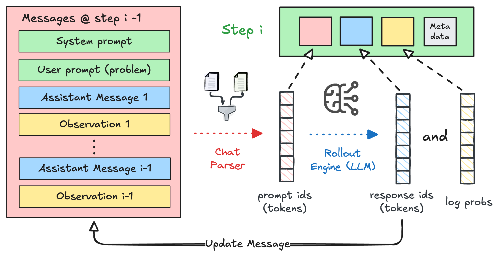
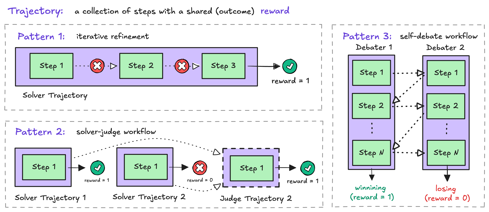
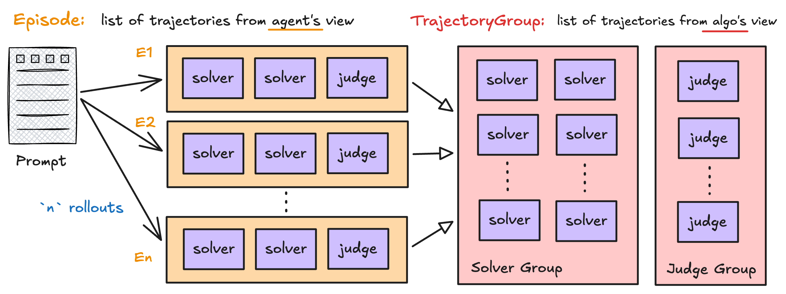

# rLLM Agent Run Format

This page gives a high-level view of the internal data progression in rLLM:

`Step -> Trajectory -> Episode -> TrajectoryGroup`.

If you need exact field-level APIs, see [rLLM Data Structures API](../api/agents/rllm-data-structures.md).

!!! info "Two valid views of the same rollout data"
    - **Workflow view**: `Episode` captures what happened in one rollout execution.
    - **Algorithm view**: `TrajectoryGroup` captures which trajectories should be compared together for training.

---

## 1. Step: The Atomic Rollout Unit



A `Step` is the smallest training-relevant unit in an rLLM run. It captures one model interaction:

- input token IDs (`prompt_ids`)
- output token IDs (`response_ids`)
- token-level log probabilities (`logprobs`)

At workflow runtime, a `Step` also carries agent/environment context (messages, observations, actions, rewards).
This makes it both:

- an execution-time state container, and
- a training-time token record for policy optimization.

---

## 2. Trajectory: Same-Role Steps Sharing Outcome



A `Trajectory` is an ordered list of `Step`s from a single role (for example, `solver`, `judge`, or `debater_1`).

In rLLM RLVR-style workflows, steps inside one trajectory are intended to share the same outcome signal at training time. Concretely:

- trajectory-level reward is represented as `trajectory.reward`
- in common broadcast-mode training, the same trajectory-level advantage is applied to every step in that trajectory

This is an intentional design decision. If you need different reward/advantage behavior across different phases, split them into separate trajectories instead of mixing them into one.

---

## 3. Episode: Workflow/Agent-Level Grouping



An `Episode` is what `Workflow.run(...)` returns for one rollout.
It groups all trajectories produced in that rollout, potentially from multiple roles.

Example (solver-judge): a single episode may contain

- `solver` trajectory #1
- `solver` trajectory #2
- `judge` trajectory #1

From the workflow engine view, this is the natural unit of execution and logging.
Its ID is rollout-scoped (`{task_id}:{rollout_idx}`), and it carries workflow metrics (`is_correct`, per-episode metadata).

---

## 4. Why TrajectoryGroup Exists

`TrajectoryGroup` is not a workflow concept; it is an algorithm concept.

RL algorithms compare rewards among trajectories that should be contrasted together (for example, GRPO over same-role rollouts). This comparison set is usually different from episode boundaries, so rLLM introduces a dedicated grouping object.

By default (`transform_episodes_to_trajectory_groups`), rLLM:

1. Optionally imputes missing trajectory names (position-based)
2. Builds groups by `(task_id, trajectory.name)`
3. Validates reward consistency and propagates from last step reward when needed (broadcast mode)
4. Stores per-trajectory metadata (rollout index, correctness, termination reason)

Result: algorithms receive data in the shape they need, without forcing workflow authors to organize episodes for optimizer logic.

Image placeholder: `[episode-to-trajectory-group.png]`

---

## 5. Runtime Transformation: Episode -> TrajectoryGroup

In the unified training pipeline:

1. Workflow engine produces `list[Episode]`
2. Transform pipeline converts them to `list[TrajectoryGroup]`
3. Advantage estimators operate on groups (and role partitions)

This separation lets one workflow representation serve different algorithmic views.

For solver-judge, default grouping typically yields:

- a `solver` group with solver trajectories across rollouts for the same task
- a `judge` group with judge trajectories across rollouts for the same task

---

## 6. Overriding Default Grouping

!!! warning "As for rLLM v0.3, this remains an experimental feature shipped with the [Unified Trainer](../experimental/unified-trainer.md)"
    If you are still using the legacy trainers (`agent_workflow_trainer` for `Verl` or `tinker_workflow_trainer` for `Tinker`), the grouping rules are not explicit, and the stepwise advantage computation pattern follows the [Stepwise GRPO guide](./rl-algos.md).

You can override grouping by passing `traj_grouping_hook` to `AgentTrainer` / `UnifiedTrainer`.

```python
from rllm.agents.agent import Episode, TrajectoryGroup
from rllm.experimental.common.config import CompactFilteringConfig, TransformConfig

def my_traj_grouping_hook(
    episodes: list[Episode],
    transform_config: TransformConfig,
    compact_filtering_config: CompactFilteringConfig | None = None,
) -> list[TrajectoryGroup]:
    ...
    return groups
```

Important expectations:

- return `list[TrajectoryGroup]` with valid rewards for downstream estimators
- keep trajectory objects by reference (do not deep-copy) so trainer-side updates remain consistent

Use this when your algorithm needs non-default contrast sets (for example, cross-role or custom tournament grouping).

??? note "Default grouping in one line"
    `group_id = f"{task_id}:{trajectory.name}"`, then all trajectories with the same `group_id` are compared together.

---

## Related Reading

- [Agent Workflow Engine](workflow-engine.md)
- [Unified Trainer](../experimental/unified-trainer.md)
- [rLLM RL Advantage Estimator](../experimental/rllm-rl-advantage-estimator.md)
