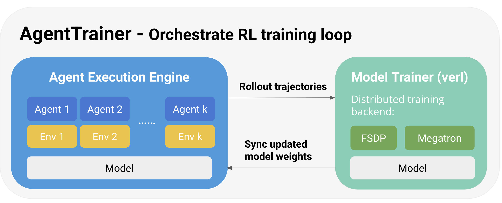

A typical RL system consists of two components:

1. **Sampler**: Generates trajectories from the current policy (i.e., the agent).
2. **Trainer**: Computes gradients from the sampled trajectories and updates the policy.

In *online RL*, this forms a closed training loop:

1. The **sampler** generates a batch of trajectories using the current agent.
2. The **trainer** updates the agent’s weights using those trajectories.
3. A new batch is generated using the **updated agent**, and the cycle repeats.

In rLLM, we design multiple components to implement the training loop in a modular way:

1. **`BaseAgent`** and **`BaseEnv`** class that user can easily extend to build their custom agents and environments
2. **`AgentExecutionEngine`** that orchestrates the interaction between agent and environment for parallelized and fully async trajectory generation.
3. **`AgentTrainer`** that orchestrates the RL training loop between the sampler (**`AgentExecutionEngine`**) and the model trainer (verl).

Below, we explain in more details how each components works, and show examples on how to use them.

### I. Agent and Environment Abstractions

rLLM provides simple, modular interfaces for defining custom agents and environments. Users can quickly prototype new agents and environments with minimal boilerplate. Check out the examples below to get started building your own agentic workflows.

- **Example:** A math agent that can self-correct its answer each turn.
    
    ```python
    class MathAgent(BaseAgent):
        def __init__(self, accumulate_thinking=True):
            self.instruction = "Let's think step by step, and put your final answer within \\boxed{}."
            self._trajectory = Trajectory()
            self.messages = []
            self.accumulate_thinking = accumulate_thinking
    
        def update_from_env(self, observation, reward, done, info, **kwargs):
            if not self.trajectory.steps:
                question = observation["question"]
                formatted_observation = f"{question} {self.instruction}"
            else:
                formatted_observation = "Your previous answer may contain a mistake. Please review it."
    
            self.messages.append({"role": "user", "content": formatted_observation})
    
        def update_from_model(self, response, **kwargs):
            self.messages.append({"role": "assistant", "content": response})
            new_step = Step(chat_completions=copy.deepcopy(self.chat_completions))
            self.trajectory.steps.append(new_step)
            return Action(action=response)
    
        def reset(self):
            self._trajectory = Trajectory()
            self.messages = []
    
        @property
        def chat_completions(self):
            messages = copy.deepcopy(self.messages)
            if not self.accumulate_thinking:
                for msg in messages[:-1]:
                    if msg["role"] == "assistant":
                        _, sep, after = msg["content"].partition("</think>")
                        if sep:
                            msg["content"] = after
            return messages
    
        @property
        def trajectory(self):
            return self._trajectory
    
        def get_current_state(self):
            assert self._trajectory.steps
            return self._trajectory.steps[-1]
    
    ```
    
- **Example:** Base environment class
    
    ```python
    class BaseEnv(ABC):
        @abstractmethod
        def reset(self) -> tuple[dict, dict]:
            pass
    
        @abstractmethod
        def step(self, action: Any) -> tuple[Any, float, bool, dict]:
            pass
    
        def close(self):
            return
    
        @staticmethod
        @abstractmethod
        def from_dict(info: dict) -> "BaseEnv":
            raise NotImplementedError("Subclasses must implement 'from_dict'")
    ```
    

### **II. `AgentExecutionEngine` for Agent-Environment Orchestration**

At the heart of this architecture is the `AgentExecutionEngine`, a high-performance sampler that:

- Orchestrates interactions between agents and environments
- Supports **fully** **asynchronous**, **parallel** trajectory rollout

During RL training, `AgentExecutionEngine` integrates seamlessly with the trainer to support RL algorithms like GRPO, PPO**,** and beyond.

- **Example:** Using `AgentExecutionEngine` for trajectory collection
    
    ```python
    engine = AgentExecutionEngine(
        agent_class=ToolAgent,
        agent_args={"tools": ["python"], "parser_name": "qwen"},
        env_class=ToolEnvironment,
        env_args={"tools": ["python"], "reward_fn": math_reward_fn},
        engine_name="openai",
        rollout_engine_args={"base_url": "http://localhost:30000/v1"},
        tokenizer=AutoTokenizer.from_pretrained("Qwen/Qwen3-4B"),
        sampling_params={"temperature": 0.6, "top_p": 0.95, "model": "Qwen/Qwen3-4B"},
        max_response_length=16384,
        max_prompt_length=2048,
        n_parallel_agents=64,
    )
    
    test_dataset = DatasetRegistry.load_dataset("aime2024", "test")
    tasks = test_dataset.repeat(n=8)  # For pass@k evaluation
    
    results = asyncio.run(engine.execute_tasks(tasks))
    compute_pass_at_k(results)
    ```
    

### III. `AgentTrainer` for Efficient RL Training

rLLM’s `AgentTrainer` exposes a simple high-level interface for users to specify their training workload and configurations, where users can easily specify the agent, environment, and training/validation dataset, and calls `trainer.train()` to train their agents with RL. 

```go
trainer = AgentTrainer(
    agent_class=ToolAgent,
    env_class=ToolEnvironment,
    config=config,
    train_dataset=train_dataset,
    val_dataset=val_dataset,
    agent_args=agent_args,
    env_args=env_args,
)
trainer.train()
```

Under the hood, the `AgentTrainer` uses rLLM’s `AgentExeuctionEngine` as trajectory sampler, [**verl](https://github.com/volcengine/verl)** as the model trainer, and uses [Ray](https://docs.ray.io/en/latest/ray-overview/getting-started.html?_gl=1*1tl1nie*_up*MQ..*_ga*MTAwODEyODkzNC4xNzUxMzk3NzA3*_ga_0LCWHW1N3S*czE3NTEzOTc3MDYkbzEkZzAkdDE3NTEzOTc3MDYkajYwJGwwJGgw) to orchestrate the control-flow between the sampler and the trainer. 

- **Example:** Using `AgentTrainer` for RL training
    
    ```python
    @hydra.main(config_path="pkg://rllm.trainer.config", config_name="ppo_trainer", version_base=None)
    def main(config):
        train_dataset = DatasetRegistry.load_dataset("hotpotqa_combined", "train")
        val_dataset = DatasetRegistry.load_dataset("hotpotqa_combined", "test")
    
        tool_map = {"local_search": LocalRetrievalTool}
        env_args = {
            "max_steps": 20,
            "tool_map": tool_map,
            "reward_fn": search_reward_fn,
        }
        agent_args = {"system_prompt": SEARCH_SYSTEM_PROMPT, "tool_map": tool_map, "parser_name": "qwen"}
        trainer = AgentTrainer(
            agent_class=ToolAgent,
            env_class=ToolEnvironment,
            config=config,
            train_dataset=train_dataset,
            val_dataset=val_dataset,
            agent_args=agent_args,
            env_args=env_args,
        )
        trainer.train()
    ```