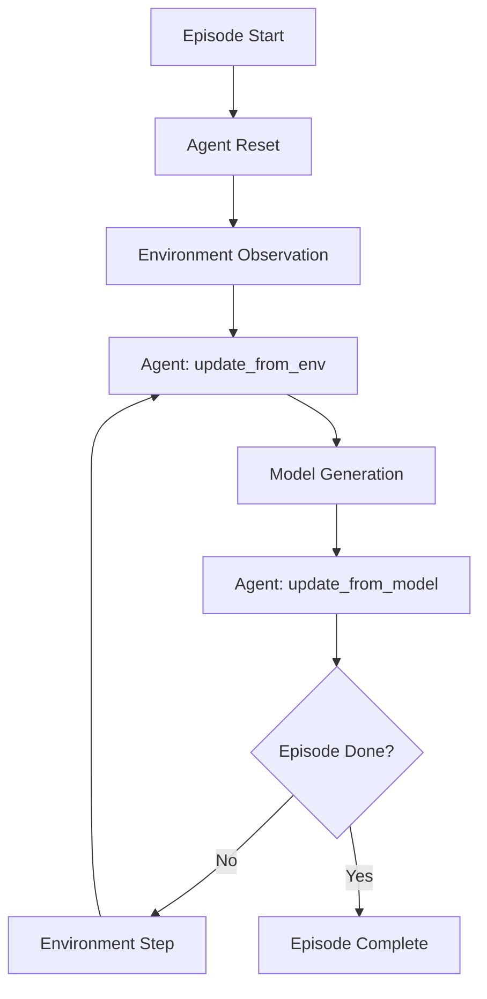

# Agents

Agents are the core components in rLLM that generate intelligent actions based on environmental observations. They serve as the bridge between language models and interactive environments, enabling autonomous problem-solving and decision-making.

## Agent Architecture

### Core Interface

All agents inherit from the `BaseAgent` class, which defines the essential methods for environment interaction:

```python
from rllm.agents.agent import BaseAgent, Step, Trajectory

class BaseAgent(ABC):
    @abstractmethod
    def update_from_env(self, observation, reward, done, info, **kwargs):
        """Updates agent state after receiving environment feedback."""
        pass
        
    @abstractmethod
    def update_from_model(self, response, **kwargs):
        """Updates agent state after receiving model response."""
        pass
        
    @abstractmethod
    def reset(self):
        """Resets agent's internal state for new episode."""
        pass
        
    @abstractmethod
    def get_current_state(self) -> Step:
        """Returns current step/state of the agent."""
        pass
    
    @property
    def chat_completions(self) -> List[Dict[str, str]]:
        """Returns messages formatted for chat completion."""
        return []
    
    @property
    def trajectory(self) -> Trajectory:
        """Returns complete interaction history."""
        return Trajectory()
```

### Interaction Flow

The agent-environment interaction follows this pattern:



1. **Initialization**: Agent calls `reset()` to prepare for a new episode
2. **Environment Feedback**: Environment provides observation, reward, and status
3. **State Update**: Agent processes feedback via `update_from_env()`
4. **Model Interaction**: Language model generates response using agent's `chat_completions`
5. **Response Processing**: Agent updates state via `update_from_model()`
6. **Repeat**: Process continues until episode completion

## Implementation Example: MathAgent

Here's a practical implementation that demonstrates the agent pattern:

```python
class MathAgent(BaseAgent):
    """
    An agent that solves mathematical problems step-by-step,
    demonstrating the complete BaseAgent interface.
    """
    
    def __init__(self, remove_thinking=False):
        self.instruction = "Let's think step by step and put the final answer within \\boxed{}."
        self._trajectory = Trajectory()
        self.messages = []
        self.step = 0
        
    def update_from_env(self, observation: Any, reward: float, done: bool, info: Dict, **kwargs):
        """Process environment feedback and update internal state."""
        
        # Format observation based on episode stage  
        if not self._trajectory.steps:
            # Initial problem presentation
            assert isinstance(observation, dict) and 'question' in observation
            question = observation['question']
            formatted_observation = f'{question} {self.instruction}'
        else:
            # Follow-up correction prompt
            formatted_observation = (
                "Your previous answer may contain a mistake. "
                "Please review it carefully and answer again. "
                "Put your final answer within \\boxed{}."
            )

        # Update previous step with outcome if it exists
        if self._trajectory.steps:
            prior_step = self._trajectory.steps[-1]
            prior_step.next_observation = formatted_observation
            prior_step.reward = reward
            prior_step.done = done
            prior_step.info = info
        
        # Skip step creation if episode is complete
        if done:
            return
        
        # Add user message and create new step
        self.messages.append({
            "role": "user",
            "content": formatted_observation
        })
        
        current_step = Step(
            observation=formatted_observation,
            step=self.step
        )
        self._trajectory.steps.append(current_step)

    def update_from_model(self, response: Any, **kwargs):
        """Process model response and update current step."""
        
        # Extract content from response
        if isinstance(response, str):
            content = response
        else:
            # Handle OpenAI-style response objects
            content = response.choices[0].message.content
        
        assert self._trajectory.steps, "Cannot update model response without active step"
        
        # Update current step with model output
        current_step = self._trajectory.steps[-1]
        current_step.thought = content 
        current_step.action = content
        current_step.model_response = content

        # Add assistant response to conversation history
        self.messages.append({
            "role": "assistant", 
            "content": content
        })
        
        self.step += 1

    def reset(self):
        """Reset agent state for new episode."""
        self._trajectory = Trajectory()
        self.messages = []
        self.step = 0

    @property
    def chat_completions(self) -> List[Dict[str, str]]:
        """Return conversation history for model interaction."""
        return self.messages
    
    @property
    def trajectory(self) -> Trajectory:
        """Return complete interaction trajectory."""
        return self._trajectory

    def get_current_state(self) -> Step:
        """Return the most recent step."""
        assert self._trajectory.steps, "No active step available"
        return self._trajectory.steps[-1]
```

## Step-by-Step Walkthrough

Let's trace through how the MathAgent handles a two-step interaction:

### Step 0: Initial Problem Solving

1. **Environment Reset**: Returns initial observation with math question
2. **Agent Processing**: 
    - Calls `update_from_env()` with the question
    - Formats question with instructions
    - Creates Step 0 and adds user message
3. **Model Generation**: Uses `chat_completions` to get model response
4. **Response Integration**: 
    - Calls `update_from_model()` 
    - Updates Step 0 with model's solution attempt
    - Adds assistant message to conversation

### Step 1: Self-Correction (if needed)

1. **Environment Feedback**: Returns reward indicating if answer was correct
2. **Agent Processing**:
    - Calls `update_from_env()` with feedback
    - Updates Step 0 with reward and next observation
    - Creates Step 1 with correction prompt (if not done)
3. **Model Generation**: Model attempts to correct previous answer
4. **Response Integration**: Updates Step 1 with final response

## Data Structures

### Step Object
```python
@dataclass
class Step:
    observation: Any = None           # Environment input
    next_observation: Any = None     # Subsequent observation
    thought: str = ""                # Agent's reasoning
    action: Any = None               # Agent's action
    reward: float = 0.0              # Environment reward
    done: bool = False               # Episode completion flag
    info: Dict = field(default_factory=dict)  # Additional metadata
    step: int = 0                    # Step number
    model_response: str = ""         # Raw model output
    mc_return: float = 0.0           # Monte Carlo return estimate
```

### Trajectory Object
```python
@dataclass
class Trajectory:
    steps: List[Step] = field(default_factory=list)  # Sequence of steps
    reward: float = 0.0                              # Total episode reward
```

## Key Design Principles

- **State Management**: Agents maintain complete interaction history through trajectories
- **Flexibility**: Abstract interface supports diverse agent implementations
- **Integration**: Seamless compatibility with OpenAI chat completion format
- **Observability**: Detailed logging of observations, thoughts, and actions

## Next Steps

- Learn about [Environments](environments.md) that agents interact with
- Explore the [API Reference](../api/agents.md) for detailed agent documentation  
- See [Examples](../examples/agents.md) for complete agent implementations 