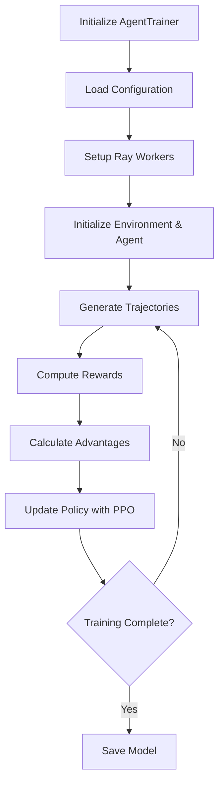

# RL Training with AgentTrainer

Training in rLLM uses reinforcement learning algorithms to update agent policies based on rewards. This page explains the training architecture, available algorithms, and how to configure and run training jobs.

## Overview

The `AgentTrainer` is the high-level interface for training reinforcement learning agents in rLLM. It provides a simplified API that wraps the underlying training infrastructure (verl), allowing you to train custom agents in custom environments without directly managing the complex distributed training setup.

## Architecture

### Core Components

The AgentTrainer orchestrates several key components:

1. **Agent**: The learning policy that generates actions based on observations
2. **Environment**: The task environment that provides observations and rewards
3. **PPO Trainer**: The underlying reinforcement learning algorithm implementation
4. **Ray Distributed System**: Handles parallel execution and resource management
5. **Reward Functions**: Compute rewards for agent actions and trajectories

### Training Flow



## Basic Usage

### Simple Training Setup

```python
import hydra
from rllm.train.agent_trainer import AgentTrainer
from rllm.agents import YourCustomAgent
from rllm.environments import YourCustomEnvironment
from rllm.data import DatasetRegistry

@hydra.main(config_path="pkg://rllm.train.config", config_name="ppo_trainer")
def main(config):
    # Load datasets
    train_dataset = DatasetRegistry.load_dataset("your_dataset", "train")
    val_dataset = DatasetRegistry.load_dataset("your_dataset", "test")
    
    # Initialize trainer
    trainer = AgentTrainer(
        agent_class=YourCustomAgent,
        env_class=YourCustomEnvironment,
        agent_args={},
        env_args={},
        config=config,
        train_dataset=train_dataset,
        val_dataset=val_dataset,
    )
    
    # Start training
    trainer.train()
```

### Advanced Configuration

For more complex scenarios, you can provide custom arguments to agents and environments:

```python
trainer = AgentTrainer(
    agent_class=ToolAgent,
    env_class=ToolEnvironment,
    agent_args={
        "system_prompt": "You are a helpful assistant",
        "tools": ["python", "search"],
        "parser_name": "qwen"
    },
    env_args={
        "max_steps": 10,
        "tools": ["python", "search"],
        "reward_fn": custom_reward_function,
    },
    config=config,
    train_dataset=train_dataset,
    val_dataset=val_dataset,
)
```

## Configuration

### Main Configuration File

The training behavior is controlled through YAML configuration files. The main configuration is `ppo_trainer.yaml` from `verl`:

#### Agent-Specific Configuration
```yaml
agent:
  max_steps: 10
  n_parallel_agents: 8
  use_stepwise_advantage: true
  trajectory_timeout: 300
```