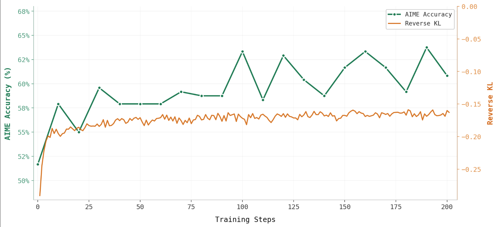

# On-Policy Distillation for Math Reasoning


This tutorial shows how to train a math reasoning student model with **On-Policy Distillation (OPD)** in rLLM's unified trainer.

OPD combines:

1. **On-policy sampling** from the student model
2. **Dense per-token feedback** from a stronger teacher model

Instead of assigning a single reward to the whole response, OPD computes token-level advantages from teacher and student log probabilities. This gives richer training signal while still training on the student's own trajectories.

## Overview

By the end of this tutorial, you will have:

1. Prepared the DeepMath and AIME datasets
2. Used rLLM's `DistillationWorkflow` and OPSD example workflow
3. Configured a teacher model for per-token supervision
4. Launched OPD training with the unified trainer

The example lives in `examples/math_distill/`.

## Setup

Before training, make sure you have:

- rLLM installed
- Access to the Tinker backend
- A student checkpoint to continue training from
- Credentials for your logging backend if you want experiment tracking

## 1. Prepare the Dataset

This example uses:

- **Training**: [DeepMath-103K](https://huggingface.co/datasets/zwhe99/DeepMath-103K)
- **Evaluation**: [AIME 2024](https://huggingface.co/datasets/HuggingFaceH4/aime_2024)

Run:

```bash
python -m examples.math_distill.prepare_deepmath_data
```

This script downloads the raw datasets, normalizes them into rLLM's expected fields, and registers them for training and validation.

The resulting samples look like:

```python
{
    "idx": 0,
    "question": "...",
    "ground_truth": "...",
    "data_source": "deepmath",
}
```

## 2. Define the Distillation Workflow

The core idea is simple:

1. Generate a response from the **student**
2. Ask the **teacher** for log probabilities on that same response
3. Compute per-token advantages from the difference
4. Pass those precomputed advantages into the unified trainer

The shared workflow abstraction for this lives in `rllm/workflows/distillation_workflow.py`.

At a high level, it:

- builds the prompt from the task
- runs the student model
- creates a `Step`
- computes `step.advantage` with `compute_step_distill_advantage()`
- returns the collected trajectory as an `Episode`

The token-level signal is:

```text
advantage[t] = log P_teacher(token_t) - log P_student(token_t)
```

In this example, rLLM also includes an OPSD workflow in `examples/math_distill/opsd/opsd_workflow.py`, where the teacher is the same base model but receives extra privileged context in its prompt.

## 3. How Advantage Computation Works

The helper `compute_step_distill_advantage()` handles teacher querying and token alignment. It supports:

- shared-tokenizer distillation
- prompt transformation for teacher-only context
- cross-tokenizer alignment
- clipped per-token advantages

Internally, once the aligned teacher and student log probabilities are available, rLLM computes the final signal with a pure algorithm helper:

```python
compute_distill_reverse_kl(
    teacher_logprobs=...,
    student_logprobs=...,
    clip_min=-5.0,
    clip_max=5.0,
)
```

This separates:

- **model-specific work**: querying the teacher and aligning tokens
- **algorithm-specific work**: turning log probabilities into clipped per-token advantages

## 4. Set Up the Trainer

The training script is `examples/math_distill/train_deepmath_distill_tinker.py`.

It does four things:

1. Loads the train and validation datasets
2. Creates the teacher engine
3. Passes workflow arguments into `DistillationWorkflow`
4. Launches unified training with backend `"tinker"`

A minimal sketch looks like:

```python
trainer = AgentTrainer(
    workflow_class=DistillationWorkflow,
    workflow_args={
        "reward_function": math_reward_fn,
        "teacher_engine": teacher_engine,
        "shared_tokenizer": True,
        "clip_min": -5.0,
        "clip_max": 5.0,
    },
    config=config,
    train_dataset=train_dataset,
    val_dataset=val_dataset,
    backend="tinker",
)
```

Two important details:

- `teacher_engine` supplies teacher log probabilities for the student's sampled completion
- `clip_min` and `clip_max` bound the token-level advantage values for stability

## 5. Configure Training

The launch script `examples/math_distill/train_deepmath_distill_tinker.sh` contains a recommended configuration.

The most important flags are:

| Flag | Purpose |
| --- | --- |
| `rllm.algorithm.use_precomputed_advantage=true` | Tells the trainer to use workflow-computed token advantages |
| `rllm.algorithm.loss_fn=importance_sampling` | Uses importance sampling for the policy update |
| `training.group_size=4` | Number of sampled responses per prompt during training |
| `validation.group_size=8` | Number of sampled responses per prompt during evaluation |
| `data.max_prompt_length=2048` | Maximum prompt length |
| `data.max_response_length=4096` | Maximum response length |

The teacher model is configured directly in the training script. In the default example, the student and teacher share a tokenizer, which keeps advantage computation simpler and faster.

## 6. Launch Training

Run the provided script:

```bash
bash examples/math_distill/train_deepmath_distill_tinker.sh
```

Or launch directly:

```bash
python -m examples.math_distill.train_deepmath_distill_tinker \
    rllm/backend=tinker \
    training.resume_from_tinker_id='tinker://<your-checkpoint>' \
    model.name=Qwen/Qwen3-8B-Base \
    model.lora_rank=128 \
    training.group_size=4 \
    validation.group_size=8 \
    training.learning_rate=1e-4 \
    data.max_prompt_length=2048 \
    data.max_response_length=4096 \
    data.train_batch_size=128 \
    data.val_batch_size=512 \
    rllm.algorithm.use_precomputed_advantage=true \
    rllm.algorithm.loss_fn=importance_sampling \
    rllm.trainer.logger=['console','wandb']
```

## 7. What Makes This Different from Standard RL

In a standard RL workflow, the trainer usually computes advantages from trajectory-level rewards.

In OPD:

- the workflow itself computes `step.advantage`
- the advantage is **dense** and **token-level**
- the trainer directly consumes those precomputed values

This means the workflow is responsible for the distillation logic, while the unified trainer remains generic.

## 8. Monitoring and Debugging

During training, watch:

- training loss
- validation math accuracy
- teacher-student divergence metrics if logged
- response truncation caused by max token limits

If results look unstable, the first things to check are:

- clipping bounds such as `clip_min` and `clip_max`
- tokenizer compatibility between student and teacher
- prompt formatting for the teacher
- batch size and response length limits
